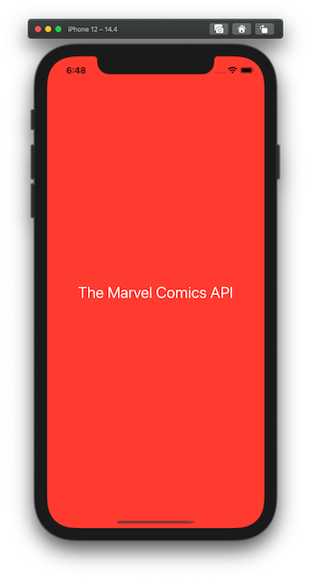
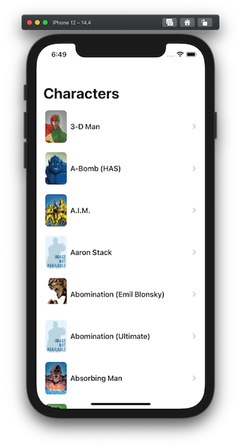
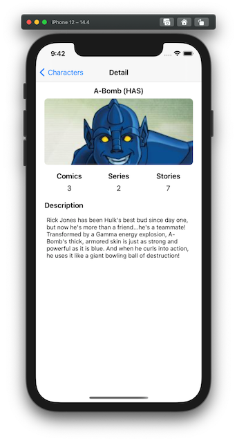

# The Marvel Comics API

API de Marvel: [https://developer.marvel.com/docs](https://developer.marvel.com/docs).

- Se necesita un Api Key, por lo que es necesario registrarse (gratis).
- Tras el registro en la web de Marvel para desarrolladores se necesita un hash MD5. Obtenido con ayuda del siguiente recurso: [https://www.md5hashgenerator.com/](https://www.md5hashgenerator.com/)

## Funcionalidad

- Listado de los personajes (/v1/public/characters)
- Navegar al detalle de un personaje en concreto (/v1/public/characters/{characterid})

## Comentarios

### API

No he mapeado por completo toda la información que recibo de cada una de las peticiones. Mi objetivo es realizar una implementación clara, sencilla, y fácilmente escalable.

- Fichero *MarvelResponse*: información recuperada.
- Fichero *MarvelAPI*: peticiones implementadas.
- Fichero *Network*: funciones de utilidad para red.
- He optado por definir todos los atributos de los structs que van a definir el modelo como opcionales, de ese modo en caso de que alguno llegase incorrecto no perdería toda la decodificación del JSON.
- Las peticiones a red tienen que ser por https, por lo que para la obtención de las imágenes he tenido que modificar el path que devuelve el API de Marvel en el momento de realizar las peticiones.
- Para las imágenes hay diferentes tamaños como se indica en [developer.marvel.com/documentation/images](https://developer.marvel.com/documentation/images). He empleado dicha característica para mostrar en un tamaño pequeño las imágenes de los personajes en la vista principal y otro más grande para la vista detalle.
- Uno de los atributos necesarios para obtener la url de las imágenes tiene como nombre *extension*. Al ser una palabra reservada del lenguaje Swift lo he resuelto con el uso de *CodingKeys*.
- Para las pruebas de las peticiones a la API he empleado [Postman](https://www.postman.com/).

### iOS

- Las dos arquitecturas nativas de Apple son:
	1. MVC para UIKit (el empleado en este caso práctico).
	2. MVVM para SwiftUI.
-  Nada de librerías de terceros. Las peticiones a red realizadas con *URLSession* y la concurrencia con *GCD*.
- Vista principal: *UITableView* con celda custom pues los tamaños de las imágenes no se adaptaban bien a la UImage que trae por defecto la celda de los prototipos dinámicos. Es importante en las celdas custom hacer uso del método *prepareForReuse* para que el rendimiento sea óptimo.
- Para la vista de detalle: *UITableView* con celdas estáticas.
- Fichero *FileManager*: creación de una caché para la gestión de imágenes y disminuir el número de peticiones a la red.
- *Auto-layout y constraints*: definidas las estríctamente necesarias para que cumplan con su cometido y con ello optimizando los recursos de renderizado.

### Capturas de pantallas

